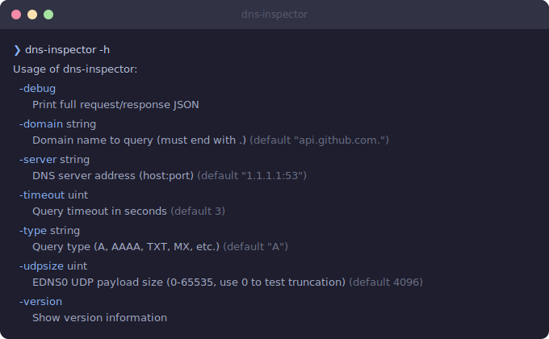
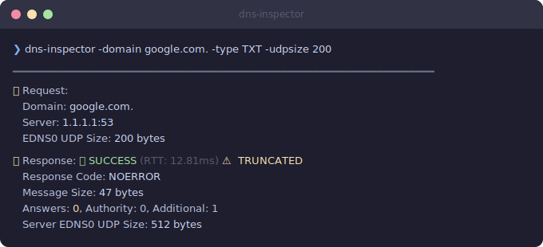
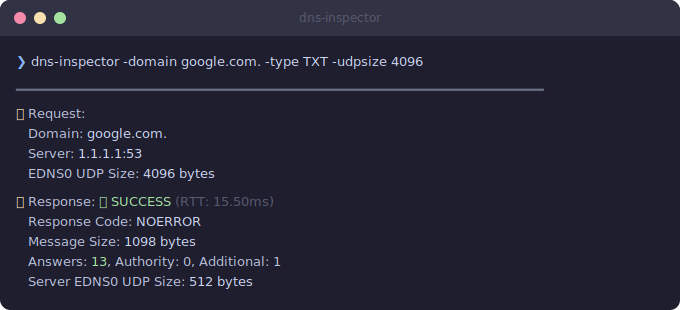
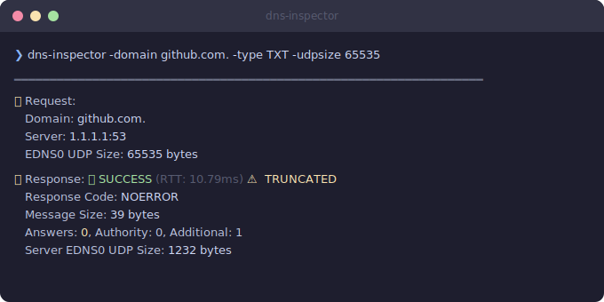

# DNS Inspector

[](https://github.com/guessi/dns-inspector/blob/main/go.mod "Go module version")
[](https://github.com/guessi/dns-inspector/blob/main/LICENSE "MIT License")
[](https://goreportcard.com/report/github.com/guessi/dns-inspector "Go Report Card for dns-inspector")

A Go CLI tool for debugging DNS queries with different EDNS0 UDP buffer sizes. Diagnoses truncation issues and helps catch silent failures where responses break under smaller buffer configurations.

## Why This Tool?

Read the full story: [Why DNS Breaks in Production but Works Locally](https://guessi.github.io/posts/2026/why-dns-breaks-in-production-but-works-locally/)

## Quick Start

```bash
go install github.com/guessi/dns-inspector@latest
dns-inspector -domain google.com.
```

## Usage



## Examples

With a small UDP buffer size (200 bytes), the response is truncated — zero answers returned:



Increasing the buffer to 4096 bytes returns the full response with all 13 answers:



### When UDP Is Not Enough

Some domains have records too large for UDP, even at the maximum buffer size. The TC (truncation) bit signals that clients should retry over TCP:



## Background

DNS responses that exceed the UDP buffer size get truncated — the server sets the TC bit and returns no answers, signaling the client to retry over TCP. Common buffer sizes:

- **512 bytes** — original limit ([RFC 1035](https://tools.ietf.org/html/rfc1035))
- **1232 bytes** — recommended minimum ([DNS Flag Day 2020](https://www.dnsflagday.net/2020/))
- **4096 bytes** — EDNS0 default ([RFC 6891](https://tools.ietf.org/html/rfc6891))

## Dependencies

- [miekg/dns](https://github.com/miekg/dns) — DNS library for Go

## License

[MIT](LICENSE)
